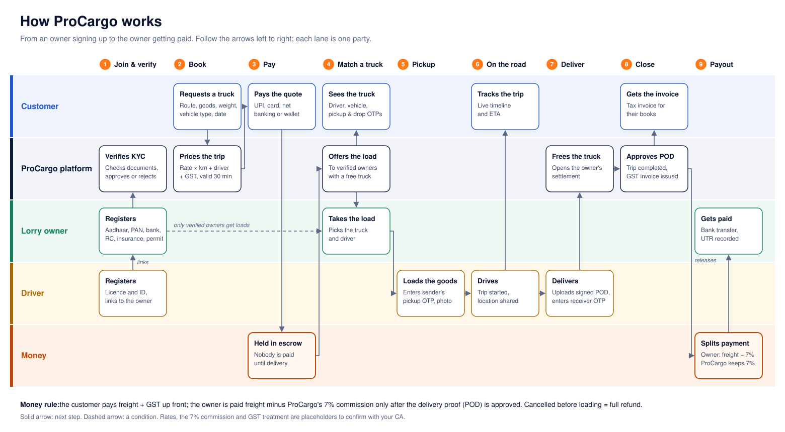

<p align="center"></p>

<p align="center"><b>Moving India. Delivering Trust.</b></p>

A technology-enabled lorry booking marketplace that connects customers who need goods moved with verified lorry owners and drivers, starting in Karnataka.



## What's in this repository

| Folder | What it is |
| --- | --- |
| [`website/`](website) | The animated **marketing website**: plain HTML, with CSS and JavaScript split into one file per section. Its "Book a truck" and "Login" buttons open the portal. |
| [`frontend/`](frontend) | The **ProCargo Portal**: React 19 + TypeScript + React Router + Axios, for customers, lorry owners, drivers and the operations team. |
| [`backend/`](backend) | The **ASP.NET Core API** on .NET 10 in Clean Architecture: Domain, Application, Infrastructure (Dapper + stored procedures) and API (REST controllers under `/api/v1`), with unit and integration tests. |
| [`database/`](database) | `ProCargo.sql` creates the database (30 tables in 8 modules, starting data); `procedures/` holds every stored procedure the API calls; `install-all.sql` runs both. |
| [`brand/`](brand) | The ProCargo logo as SVG and PNG, for light and dark backgrounds. |
| [`docs/`](docs) | The [API reference](docs/API.md), the [technical blueprint](docs/TECHNICAL-BLUEPRINT.md), the [refactoring plan](docs/REFACTORING-PLAN.md) and the business flow above. |

## How the code is organised

```
backend/
├─ src/ProCargo.Domain/          Entities, status constants, pricing, GST and trip-step rules. No dependencies.
├─ src/ProCargo.Application/     One folder per feature: service, DTOs, FluentValidation validators, and the
│                                repository interfaces it needs. Depends only on Domain.
├─ src/ProCargo.Infrastructure/  Dapper repositories (stored procedures only), SQL connection factory, JWT,
│                                encryption, file storage, SMS. Implements the Application interfaces.
├─ src/ProCargo.API/             Thin controllers, auth policies, ProblemDetails, Swagger, CORS, rate limiting.
└─ tests/                        ProCargo.UnitTests, ProCargo.IntegrationTests

frontend/src/
├─ api/          apiClient.ts (the one Axios instance) and one module per API area
├─ auth/         AuthProvider, useAuth, ProtectedRoute, RoleProtectedRoute, token storage
├─ routes/       AppRoutes.tsx (every page and who may open it), navigation menus
├─ layouts/      AppShell (sidebar), AuthLayout
├─ pages/        One page per route, by role: auth/, customer/, owner/, driver/, admin/, shared/
├─ features/     Dialogs and pieces a page is built from: bookings/, trips/, fleet/, admin/, auth/
├─ components/   Button, Field, Dialog, Pill, Pagination, UploadDialog … one per file
├─ hooks/        useLoad, usePagedLoad, useAction
├─ services/     Cached reference data, phone location
├─ types/        The API's request and response shapes
├─ utils/        Formatting (₹, kg, dates), status labels, document names
└─ styles/       tokens, base, layout, buttons, forms, feedback, data, charts, pages (no inline styles)
```

The [technical blueprint](docs/TECHNICAL-BLUEPRINT.md#code-layout-as-built) explains each layer.

## Run it on your computer

You need **SQL Server** (Express or Developer is free), the **.NET 10 SDK** and **Node.js 22**. VS Code or Visual Studio, and SQL Server Management Studio, are recommended. Prefer containers? Skip to [Run everything with Docker](#run-everything-with-docker).

### 1. Create the database

In SQL Server Management Studio open `database/install-all.sql`, turn on **Query → SQLCMD Mode**, and press **F5**. Or from a terminal:

```bash
cd database
sqlcmd -S localhost -E -C -I -i install-all.sql
```

It creates the `ProCargo` database, its tables and starting rate card, then every stored procedure. After pulling new code, run the files in `database/procedures/` again; they are safe to re-run.

### 2. Start the API

```bash
cd backend/src/ProCargo.API

# Only if your SQL Server is not the default local instance (for example SQL Server Express):
dotnet user-secrets set "Database:ConnectionString" "Server=.\SQLEXPRESS;Database=ProCargo;Trusted_Connection=True;TrustServerCertificate=True"

dotnet run --launch-profile https
```

The API starts on **https://localhost:7001** (and http://localhost:5080). Open **https://localhost:7001/swagger**, sign in with *POST /auth/otp* and *POST /auth/login*, then press **Authorize** and paste the `accessToken` to try every endpoint. On first start it creates an admin with mobile **9999999999** (change `Seed:AdminMobile` before the first run to use another).

Development settings (`appsettings.Development.json`) include a local-only signing key and show sign-in codes on screen. For any other environment, set the secrets through user-secrets or environment variables, never in a file:

| Setting | Environment variable |
| --- | --- |
| `Database:ConnectionString` | `Database__ConnectionString` |
| `Jwt:SigningKey` (32+ random characters) | `Jwt__SigningKey` |
| `Cors:AllowedOrigins` | `Cors__AllowedOrigins__0`, `Cors__AllowedOrigins__1`, … |

### 3. Start the portal

```bash
cd frontend
npm install
npm run dev
```

Open **http://localhost:5173**. The portal calls the API at `VITE_API_BASE_URL`, set to `https://localhost:7001/api/v1` in `frontend/.env.development`. To point it elsewhere, create `frontend/.env.development.local` (see `frontend/.env.example`). If the browser blocks the API's development certificate, run `dotnet dev-certs https --trust` once.

### 4. Open the website

Open `website/index.html` in your browser, or better, right-click it in VS Code and choose **Open with Live Server** (the extension), which serves it at http://127.0.0.1:5500. With the API running, the price box asks the API for the live price; without it, it estimates from the same rate card and says so. Portal and API addresses are at the top of `website/js/config.js`.

### 5. Try the whole business in 10 minutes

In Development the sign-in code is shown on screen (no SMS needed), and payments run in **test mode**.

1. **Owner:** Register → *I own lorries* → upload KYC documents → *Vehicles* → add a 14 FT truck and upload its RC.
2. **Driver:** Register → *I drive* → enter the owner's mobile number.
3. **Customer:** Register → *I need transport* → book Bengaluru → Hubballi → pay (test mode).
4. **Admin** (mobile 9999999999): *Approvals* → approve the owner, driver and vehicle.
5. **Owner:** *Loads & overview* → *Take this load* → pick the truck and driver.
6. **Customer:** open the booking to see the truck, the driver, and the pickup and delivery codes.
7. **Driver:** *My trips* → on the way → reached pickup → enter the pickup code → start → reached destination → upload POD → enter the delivery code.
8. **Admin:** *Trips & POD* → approve POD (the GST invoice is issued) → *Owner payouts* → record the bank UTR.

Every step is stored in SQL Server through stored procedures: `Bookings`, `Quotes`, `Payments`, `Trips`, `TripEvents`, `Documents`, `Invoices`, `Settlements` and `AuditLogs`. The same journey runs automatically in CI (`frontend/e2e/smoke.mjs`).

## Run everything with Docker

```bash
cp .env.example .env     # then change the passwords and the signing key
docker compose up --build
```

Open **http://localhost:8080**. Compose starts SQL Server, installs or updates the database, and runs the API and the portal; nginx serves the portal and forwards `/api` to the API. Uploaded files and encryption keys live in the `api-data` volume: back it up.

## Tests

```bash
cd backend
dotnet test                         # unit tests and API tests with fake repositories
```

The SQL Server journeys in `ProCargo.IntegrationTests/SqlServer` run when `PROCARGO_TEST_SQL` holds a connection string to a database installed with `install-all.sql`; otherwise they are skipped. CI (`.github/workflows/ci.yml`) installs SQL Server in Docker and runs all of them, type-checks and builds the portal, runs the end-to-end portal test in Chromium, and builds both Docker images.

## Moving from the previous version

- The old `backend/ProCargo.Api` (Entity Framework, minimal APIs) is replaced by the four projects above. The database tables are unchanged; only stored procedures and the `RefreshTokens` usage are added, so an existing `ProCargo` database just needs the files in `database/procedures/`.
- **Copy the old `App_Data/keys` folder** to the new API's `App_Data/keys` (or the `api-data` volume). PAN, bank account numbers and trip codes are encrypted with those keys; without them they can't be read.
- Users sign in again once, because sign-in now uses short access tokens plus refresh tokens.
- Every route moved under `/api/v1`; [docs/API.md](docs/API.md#routes-in-the-previous-api) maps old to new.

## Before going live

| Item | Where |
| --- | --- |
| Set a strong JWT signing key (32+ random characters) | `Jwt__SigningKey` environment variable or a key vault, never in Git |
| Send OTPs by SMS (MSG91 or Twilio India, DLT registered) | Implement `ISmsSender` (today `Infrastructure/Messaging/LoggingSmsSender.cs`) |
| Connect a payment gateway (Razorpay or Cashfree) | `Application/Features/Bookings/BookingService.cs` → `PayAsync`; set `Payments:Mode` |
| Move uploads to Azure Blob Storage | Implement `IFileStorage` (today `Infrastructure/Storage/LocalFileStorage.cs`) |
| Keep encryption keys in Azure Key Vault | `Infrastructure/DependencyInjection.cs` → Data Protection |
| Use real road distances (Google or Azure Maps) | `Domain/Pricing/DistanceEstimator.cs` |
| Behind a proxy or load balancer, list its network | `ReverseProxy:KnownNetworks`, so rate limits see the real client IP |
| Confirm rates, the 7% commission, GST and TDS with your CA | The `VehicleTypes` and `Settings` tables |

## Notes

- Aadhaar numbers are never stored, only the last 4 digits. PAN and bank account numbers are encrypted.
- Blocking a user in *Admin → Users* signs them out immediately.
- Never commit passwords, API keys or real customer data to this repository.
