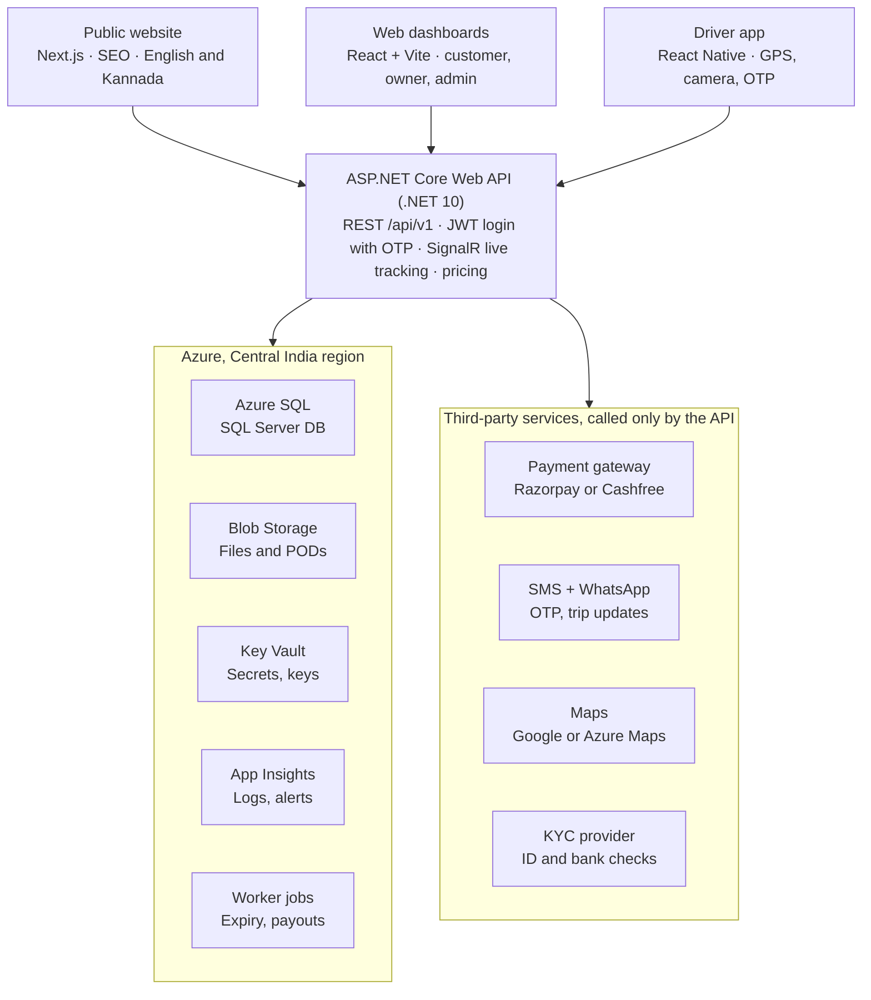
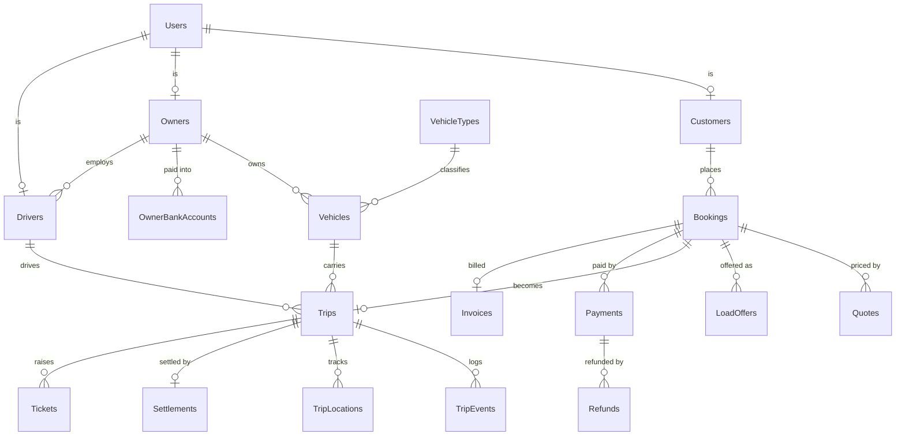

# ProCargo – Technical Blueprint

Prepared 1 Oct 2026 for Prashanth Olekar; updated 3 Oct 2026 for the ProCargo brand and 4 Oct 2026 for the Clean Architecture refactor. Also available as a live, editable doc in Claude.

## Contents

1. [What has been built so far](#what-has-been-built-so-far)
2. [System architecture](#system-architecture)
3. [Database design (SQL Server)](#database-design-sql-server)
4. [Backend: ASP.NET Core Web API](#backend-aspnet-core-web-api)
5. [Frontend: React + Vite + TypeScript](#frontend-react--vite--typescript)
6. [Code layout (as built)](#code-layout-as-built)
7. [Key flow: booking to owner payout](#key-flow-booking-to-owner-payout)
8. [Security and compliance](#security-and-compliance)
9. [Build roadmap](#build-roadmap)


## What has been built so far

You now have a clickable prototype of the whole platform: a motion homepage plus customer, owner, driver and admin dashboards. It runs in the browser only, with sample data and no database yet. This blueprint is how to turn it into the real product.

| Step | What was done | Result |
| --- | --- | --- |
| 1 | Studied allcargo.com for layout and tone | Freight-site structure, reworked with far more motion |
| 2 | Built the first "Truckload" landing page | Moving lorry hero, fleet cards, scroll-driven route, fare estimator |
| 3 | Rebuilt it as Olekar Logistics (now ProCargo) from your full brief | One page, about 180 KB, with 15 homepage sections and 6 app views |
| 4 | Added working interactions on sample data | Live quote, accept booking, vehicle status, driver OTP steps, admin approvals, POD approval, settlements |
| 5 | Tested in a headless browser | No script errors; no sideways scroll at phone width |
| 6 | Designed the SQL Server database | 30 tables in [`database/ProCargo.sql`](../database/ProCargo.sql) |
| 7 | Published to this GitHub repository | `index.html`, SQL script and this blueprint |
| 8 | Built the working portal and API | React pages for all four roles on an ASP.NET Core 8 API that saves everything to SQL Server |
| 9 | Drew the business flow | [`business-flow.svg`](business-flow.svg), from sign-up to owner payout |
| 10 | Renamed the brand to ProCargo and tidied every file | New logo, `ProCargo` database, one C# class per file, React components in their own files, CSS split by area, no inline styles |
| 11 | Refactored to production architecture ([plan](REFACTORING-PLAN.md)) | .NET 10 Clean Architecture, Dapper + stored procedures, `/api/v1` REST controllers, refresh tokens, ProblemDetails, server-side paging; portal on React Router + Axios; unit, integration and browser tests in CI; Docker |

**Technology in the prototype:** plain HTML, CSS and JavaScript, with GSAP for scroll animation, Lucide for icons, and Google Fonts (Archivo, Instrument Sans, JetBrains Mono, Noto Sans Kannada). The truck, highway, maps and phones are drawn in code, so there are no image files.

**What is sample, not real:** every number, name, testimonial, rate card value and the 7% commission. Data resets on page reload because nothing is saved. Logins, OTP SMS, payments and file storage are simulated. Everything below replaces those simulations with a real backend.

## System architecture

Three apps share one ASP.NET Core API. The API is the only thing that reads or writes SQL Server, which keeps prices, statuses and payouts under your control.



Host everything in Azure's Central India region (Pune) so data stays in India and pages load fast in Karnataka. Start with Azure App Service for the API and websites; move to containers only when traffic needs it.

## Database design (SQL Server)

The database has 30 tables in 8 modules, all in one SQL Server database named `ProCargo`. The runnable script [`database/ProCargo.sql`](../database/ProCargo.sql) creates every table, key, index and the starting vehicle rate card.

**Conventions used everywhere**

- Primary keys are `BIGINT IDENTITY` named `<Table>Id`. Public numbers such as `PC-24790` are separate columns, so internal ids are never shown to users.
- Money is `DECIMAL(12,2)` in rupees. Times are `DATETIME2(0)` in UTC and converted to IST in the app.
- Statuses are short `VARCHAR` codes with a `CHECK` constraint, for example `InTransit`. This makes them readable in reports and safe from typos.
- Every table has `CreatedAt`, and editable tables add `UpdatedAt` and a `RowVersion` column so two admins can't overwrite each other.
- Nothing is hard-deleted. Records use `IsActive` or a status, and every change is written to `AuditLogs`.

| Module | Table | Holds | Key columns | Links to |
| --- | --- | --- | --- | --- |
| Accounts | `Users` | Everyone who logs in | Role (Customer, Owner, Driver, Admin), FullName, Mobile (unique), Email, PreferredLanguage, Status | — |
| Accounts | `OtpCodes` | Login, pickup and delivery codes | Mobile, Purpose, CodeHash, ExpiresAt, Attempts, UsedAt | Users, Trips |
| Accounts | `RefreshTokens` | Keeps users signed in | TokenHash, ExpiresAt, RevokedAt, DeviceInfo | Users |
| Accounts | `Addresses` | Saved pickup and drop points | Label, Line1, City, State, Pincode, Latitude, Longitude | Users |
| Customers | `Customers` | Business profile | CompanyName, GSTIN, BillingAddressId, CreditLimit | Users |
| Partners | `Owners` | Lorry owner profile and KYC | BusinessName, PanEncrypted, AadhaarLast4, AadhaarVaultRef, KycStatus, VerifiedBy, VerifiedAt | Users |
| Partners | `OwnerBankAccounts` | Where payouts go | AccountHolder, AccountNumberEncrypted, AccountLast4, IFSC, PennyDropStatus, IsPrimary | Owners |
| Partners | `Drivers` | Driver profile | LicenceNumber, LicenceClass, LicenceExpiry, EmergencyContactName, EmergencyContactPhone, KycStatus, Rating | Users, Owners |
| Master data | `Cities` | Service cities | Name, State, Latitude, Longitude, IsServiceable | — |
| Master data | `VehicleTypes` | The 11 vehicle classes and rate card | Code, Name, MaxLoadKg, LengthFt, WidthFt, HeightFt, BodyType, RatePerKm, MinFare, DriverBattaPerDay | — |
| Master data | `GoodsCategories` | Household, industrial, agri and so on | Name, RequiresEwayBill | — |
| Master data | `Settings` | Commission %, GST rates, OTP expiry | SettingKey, SettingValue | — |
| Fleet | `Vehicles` | Each registered lorry | RegistrationNumber (unique), CapacityKg, AvailabilityStatus (Available, Busy, Maintenance), VerificationStatus, CurrentDriverId, LastLatitude, LastLongitude | Owners, VehicleTypes, Drivers |
| Documents | `Documents` | Every uploaded file | EntityType, EntityId, DocType (RC, Insurance, Fitness, Permit, PUC, Aadhaar, PAN, Licence, POD…), BlobPath, ExpiryDate, Status, ReviewedBy, RejectionReason | Any entity |
| Bookings | `Bookings` | A customer's transport request | BookingNumber, pickup and drop address and coordinates, GoodsDescription, WeightKg, PickupDate, SpecialInstructions, Status | Customers, VehicleTypes, GoodsCategories |
| Bookings | `Quotes` | Price offered for a booking | DistanceKm, VehicleCost, DriverCost, PlatformFee, TaxAmount, TotalAmount, ValidUntil, Status | Bookings |
| Bookings | `LoadOffers` | Loads shown to owners | OfferedPayout, Status (Offered, Accepted, Declined, Expired), RespondedAt | Bookings, Owners, Vehicles |
| Trips | `Trips` | The actual journey | TripNumber, Status, PickupOtpProtected, DeliveryOtpProtected (encrypted), StartedAt, DeliveredAt, OwnerPayout | Bookings, Vehicles, Drivers, Owners |
| Trips | `TripEvents` | Timeline shown to customers | EventType (ReachedPickup, Loaded, Started…), Note, Latitude, Longitude, CreatedBy | Trips |
| Trips | `TripLocations` | GPS pings every 30 s | Latitude, Longitude, SpeedKmph, RecordedAt | Trips |
| Money | `Payments` | Customer payments | Amount, Method (UPI, Card, NetBanking, Wallet), Gateway, GatewayOrderId, GatewayPaymentId, Status | Bookings |
| Money | `Refunds` | Money returned | Amount, Reason, GatewayRefundId, Status | Payments |
| Money | `Invoices` | GST invoices | InvoiceNumber, TaxableAmount, CGST, SGST, IGST, TotalAmount, PdfDocumentId | Bookings, Customers |
| Money | `Settlements` | Owner payouts | GrossAmount, CommissionAmount, TdsAmount, NetAmount, Status, UTR, ReleasedBy, ReleasedAt | Trips, Owners, OwnerBankAccounts |
| Support | `Tickets` | Complaints and support requests | TicketNumber, Category, Priority, Description, Status, AssignedTo, Resolution | Users, Trips |
| Support | `TicketMessages` | Replies on a ticket | Message, AttachmentDocumentId | Tickets, Users |
| Support | `Ratings` | Stars after each trip | Stars, Comment | Trips, Users |
| Platform | `Notifications` | SMS, WhatsApp, email and in-app messages | Channel, Title, Body, SentAt, ReadAt | Users |
| Platform | `FraudFlags` | Suspicious activity | RuleCode, Detail, Severity, Status, ReviewedBy | Users |
| Platform | `AuditLogs` | Who changed what | ActorUserId, Action, EntityType, EntityId, OldValues, NewValues (JSON), IpAddress | Users |

**How the main records connect:**



**Growth:** `TripLocations` grows fastest, about 2,900 rows per 24-hour trip at one ping every 30 s. Partition it by month, or move pings older than 90 days to cheap storage.

## Backend: ASP.NET Core Web API

One ASP.NET Core Web API on **.NET 10 (C# 14)**, organised as **Clean Architecture**: a modular monolith with four projects whose references point inwards only. Data access is **Dapper calling SQL Server stored procedures**, so every query, filter, sort and page is in reviewed SQL, and the API's database login needs only `EXECUTE` permission.

**Solution layout**

```
backend/ProCargo.sln
├─ src/
│  ├─ ProCargo.Domain/           Entities, status constants, pricing, GST split, invoice numbers, trip steps. No references.
│  ├─ ProCargo.Application/      Use cases per feature (BookingService, TripService …), DTOs, FluentValidation validators,
│  │                             and the interfaces it needs: repositories, ITokenService, IFileStorage, ISmsSender. → Domain
│  ├─ ProCargo.Infrastructure/   Dapper repositories over stored procedures, SqlConnectionFactory, SQL error translation,
│  │                             JWT, Data Protection encryption, local file storage, SMS. → Application
│  └─ ProCargo.API/              Thin controllers, auth policies, ProblemDetails, OpenAPI + Swagger UI, CORS, rate limiting,
│                                security headers. → Application, Infrastructure (composition only)
└─ tests/
   ├─ ProCargo.UnitTests/        Domain rules, validators, services with NSubstitute fakes
   └─ ProCargo.IntegrationTests/ The real API with fake repositories (401/403/404/409/400), and full journeys on SQL Server
```

**Endpoints:** every route is under `/api/v1`. The full list, with roles and status codes, is in the [API reference](API.md).

**Cross-cutting pieces**

- **Login:** mobile number + OTP for everyone. A 30-minute JWT access token carries the user's id and role; a 14-day refresh token (stored hashed, rotated on every use, revoked on logout or when the user is blocked) renews it. Controllers check named policies such as `CustomerOnly` or `OwnerOrAdmin`, every endpoint needs a signed-in user unless marked public, and services check ownership (a customer only sees their own bookings).
- **Errors:** one global exception handler turns validation, business-rule, not-found, conflict and SQL errors into RFC 7807 ProblemDetails, without internal details.
- **Live tracking:** a SignalR hub pushes new positions and status changes to the open customer, owner and admin screens, so nobody has to refresh.
- **Files:** the app uploads straight to a private Azure Blob container using a SAS link that lasts 10 minutes. The API stores only the path in `Documents`, and hands out short read links when an admin reviews.
- **Payments:** create the order on the gateway (Razorpay, Cashfree or PayU), let the customer pay in the gateway's checkout, then trust only the signed webhook, never the browser, to mark it paid. Owner payouts go through the same gateway's payout API.
- **Messages:** SMS OTP through an Indian DLT-registered provider (MSG91 or Twilio India), trip updates through the WhatsApp Business API. Every send is logged in `Notifications`.
- **Maps:** Google Maps or Azure Maps for distance, ETA and address search. Cache route distances so repeat quotes cost nothing.
- **Background jobs:** expire old quotes and load offers, alert on documents expiring within 30 days, retry failed payouts, flag trips with no GPS for 30 minutes, and generate invoice PDFs.
- **Quality:** Swagger for API docs, Serilog + Application Insights for logs, rate limiting on OTP endpoints, and automated tests for pricing and status changes.

## Frontend: React + Vite + TypeScript

Split the prototype into two web apps and one mobile app that share one API. The public website must load fast and rank on Google. The dashboards sit behind a login and can be heavier.

| App | Built with | Who uses it | Why separate |
| --- | --- | --- | --- |
| Public website | Next.js (React), server-rendered | Visitors, Google | SEO, fast first load, Kannada pages at `/kn` |
| Web dashboards | React + Vite + TypeScript | Customers, owners, admins | Rich screens, charts, tables |
| Driver app | React Native (Expo) | Drivers | GPS in the background, camera for POD, works on patchy networks |

**Shared building blocks**

- **Styling:** Tailwind CSS with the prototype's colours and fonts saved as design tokens (navy `#0A1A3A`, orange `#FF7A1A`, Archivo headings).
- **Motion:** GSAP ScrollTrigger for the hero truck, route and vehicle carousel; Framer Motion for card and page transitions.
- **Data:** React Query for every API call (caching, retries, loading states); React Hook Form + Zod for form validation.
- **Icons and charts:** Lucide icons; Recharts for the admin charts.
- **Language:** `react-i18next` with `en.json` and `kn.json` files, so every label can be translated rather than only headings.
- **Maps:** Google Maps JS or Azure Maps for the live tracking map, with SignalR for live truck positions.

**Portal project layout (as built)**

```
frontend/src/
├─ api/          apiClient.ts (Axios, VITE_API_BASE_URL, token refresh, ProblemDetails errors) + one module per API area
├─ auth/         AuthContext, AuthProvider, useAuth, ProtectedRoute, RoleProtectedRoute, PublicOnlyRoute, tokenStorage
├─ routes/       AppRoutes.tsx (React Router: every page and the roles allowed), navigation.ts (menus, home pages)
├─ layouts/      AppShell (sidebar + top bar), AuthLayout
├─ pages/        auth/, customer/, owner/, driver/, admin/, shared/ – one page per route
├─ features/     bookings/, trips/, fleet/, admin/, auth/ – dialogs, cards and step logic used by the pages
├─ components/   Button, Field, Dialog, Pill, Pagination, UploadDialog, Toast …
├─ hooks/        useLoad, usePagedLoad, useAction
├─ services/     referenceData (cached), location
├─ types/        API request and response shapes
└─ utils/        format, status, documents
```

**How the prototype maps across:** each sidebar screen in the prototype (`index.html`) becomes one feature page. The sample arrays (`CUST`, `OWNER`, `ADM`) become API calls. The prototype's `quote()` function moves to the server, so customers can't change prices in the browser. The drawn trucks and scenes can be kept as SVG components or swapped for real photos.

## Code layout (as built)

Every file holds one thing, and each folder has one job, so you can find code by its name.

```
database/
├─ ProCargo.sql                        Creates the ProCargo database: sequences, 30 tables, views, starting data
├─ procedures/                         Every stored procedure the API calls, by area; CREATE OR ALTER, safe to re-run
│  ├─ 01_ReferenceData.sql … 06_DocumentsAndMoney.sql
├─ install-all.sql                     Runs both (SQLCMD mode)
└─ docker-init.sh                      Used by docker-compose: install or update

backend/
├─ src/ProCargo.Domain/                Constants/ (roles, statuses, document types), Entities/, Pricing/, Invoicing/, Trips/, Common/
├─ src/ProCargo.Application/
│  ├─ Abstractions/                    Persistence/ (19 repository interfaces), Security/, Storage/, Messaging/, ICurrentUser
│  ├─ Common/                          Exceptions (400/403/404/409/429/501), Paging (PagedResult, ListQuery)
│  └─ Features/<Area>/                 I<Area>Service + service, request/response records, validators
├─ src/ProCargo.Infrastructure/
│  ├─ Data/                            SqlConnectionFactory, StoredProcedures (names), StoredProcedureExecutor, SqlErrorTranslator
│  ├─ Repositories/                    One Dapper repository per interface; CommandType.StoredProcedure only
│  ├─ Security/                        JwtTokenService, PersonalDataProtector
│  └─ Storage/, Messaging/
├─ src/ProCargo.API/
│  ├─ Program.cs                       About 20 lines: one call per concern
│  ├─ Controllers/                     One controller per resource, each action one service call
│  ├─ Extensions/                      Services and the request pipeline, one file per concern
│  ├─ ErrorHandling/, Middleware/      GlobalExceptionHandler; security headers; blocked-account check
│  └─ Configuration/                   Strongly typed settings (CORS, rate limits, reverse proxy, seed)
└─ tests/                              ProCargo.UnitTests, ProCargo.IntegrationTests

frontend/                              The portal: see the layout in the Frontend section; e2e/smoke.mjs runs the whole journey

website/                               The marketing site (plain HTML, CSS, JavaScript)
├─ index.html                          Page markup only
├─ css/                                One stylesheet per section: hero, services, vehicles, tracking …
├─ js/                                 config (portal address), data, i18n, one script per section, main.js last
└─ assets/                             Logo files

docker-compose.yml                     SQL Server, database install, API and portal (nginx)
.github/workflows/ci.yml               Build and test everything on every push
```

## Key flow: booking to owner payout

A trip takes 8 steps, and the owner is paid only after the admin approves the proof of delivery.

```mermaid
flowchart LR
    s1["1 · Customer books<br/>Bookings: QuotePending<br/>Quotes: Sent"] --> s2["2 · Pays for quote<br/>Payments: Captured<br/>Bookings: Confirmed"]
    s2 --> s3["3 · Truck assigned<br/>LoadOffers: Accepted<br/>Trips: Assigned"]
    s3 --> s4["4 · Pickup OTP<br/>Goods photo saved<br/>Trips: InTransit"]
    s4 --> s5["5 · Live tracking<br/>TripLocations every 30 s<br/>TripEvents timeline"]
    s5 --> s6["6 · Delivery OTP<br/>POD photo saved<br/>Trips: Delivered"]
    s6 --> s7["7 · Admin approves POD<br/>Trips: Completed<br/>Invoices: issued"]
    s7 --> s8["8 · Owner paid<br/>Settlements: Released<br/>Commission kept"]
```



If a booking is cancelled before loading, it moves to `Cancelled` and a `Refunds` row returns the money. If a quote passes its 30-minute validity, it becomes `Expired` and the customer gets a fresh one.

## Security and compliance

You will hold Aadhaar, PAN, bank accounts and live locations, so protecting that data is a legal duty and not optional. Build these in from day one; they are hard to add later.

**Personal data**

- **Aadhaar:** never store the full number. Verify through a licensed KYC provider or DigiLocker and keep only the last 4 digits, the provider's reference and a masked copy.
- **PAN and bank account:** encrypt these columns with keys held in Azure Key Vault. Show only the last 4 digits on every screen.
- **Consent:** India's Digital Personal Data Protection Act, 2023 requires clear consent, use only for the stated purpose, and deletion when a user leaves. Add a privacy policy, a consent tick box and a way to request deletion.

**Platform security**

- HTTPS everywhere; the database is encrypted at rest by Azure SQL.
- Every password, API key and gateway secret lives in Key Vault, never in code or GitHub.
- Blob storage is private. Files are opened only through links that expire in minutes.
- OTPs are stored as hashes, expire in 10 minutes, lock after 5 wrong tries, and the send endpoint is rate-limited.
- Admins use two-factor login. Each admin action writes to `AuditLogs`.
- Card and UPI details are handled only by the payment gateway, which keeps you out of PCI card-data scope.
- Daily automated backups with point-in-time restore, which Azure SQL includes.

**Tax and transport rules to confirm with your CA**

- GST on freight: how GTA services are taxed, whether you charge GST on the full fare or only on your platform fee, and CGST/SGST vs IGST for interstate trips.
- TDS on owner payouts under Section 194C, including the exemption for owners with 10 or fewer goods vehicles who give a PAN declaration.
- E-way bills for goods above the value limit. The booking form already has a `GoodsValue` field for this.
- Whether acting as a marketplace needs any state transport or broker licence in Karnataka.

## Build roadmap

Build the money path first and launch on one lane, Bengaluru to Hubballi, before adding more cities. These week counts are an estimate for two developers.

| Phase | Weeks | What gets built | Gate to move on |
| --- | --- | --- | --- |
| 1. Foundation | 1–4 | SQL database live, OTP login and roles, rate card and cities, owner and driver KYC | Security review |
| 2. Booking MVP | 5–10 | Customer booking, quotes and payments, owner load offers, admin assignment | 10 paid test bookings |
| 3. Trips and payouts | 11–16 | Driver app with OTP, GPS live tracking, POD and invoices, owner settlements | First payout sent |
| 4. Pilot launch | 17–20 | Bengaluru–Hubballi lane, 20 owners and 50 trips, Kannada and WhatsApp, analytics dashboard | — |

**Team to start:** one ASP.NET Core + SQL Server developer, one React / React Native developer, a part-time designer and tester, and your CA for GST and TDS setup. Until the driver app is ready, drivers can use the web version on their phones.

**Your next steps**

- [x] Push the prototype, SQL script and blueprint to GitHub
- [ ] Run `database/install-all.sql` (or `docker compose up`), start the API and portal, and walk through the flow in the README
- [ ] Open accounts with a payment gateway and a DLT-registered SMS provider (both need business KYC and take 1–3 weeks)
- [ ] Confirm rates, commission and GST treatment with your CA
- [ ] Line up 10–20 lorry owners on the Bengaluru–Hubballi lane for the pilot
